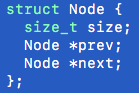

<h1>My Malloc</h1>

<h3>Assignment Overview</h3>

For this assignment, your job is to implement your own version of malloc and free, namely mmalloc and mfree.

<h4>Requirements:</h4>
<ul>
<li>Must implement memory allocation using the free list methodology described in lecture.</li>
<li>Must implement mmalloc as: void *mmalloc( size_t size );
  <ul>
    <li>works similar to malloc</li>
    <li>takes a size_t</li>
    <li>finds space on the heap (in the free list)</li>
    <li>returns a void * pointer</li>
  </ul>
</li>
  <li>Must implement mfree as void mfree( void * );
    <ul>
    <li>works similar to free</li>
    <li>takes a void * pointer</li>
    <li>deallocates the memory (appends memory to free list)</li>
    <li>DO NOT need to worry about fragmentation.</li>
  </ul>
</li>
  <li>Must use brk(..) or sbrk(..) system calls to allocate heap space (only when necessary).</li>
  <li>Must use the first fit algorithm to find space in the free list.</li>
  <li>Must implement malloc via a free list.</li>
  <li>Must use a block size of 1024 bytes</li>
  <li>Cannot use malloc, free, new, or delete.</li>
  <li>Cannot use system( .. ).</li>
  <li>Must implement a printFreeList( ) function that prints state of free list.
    <ul>
      <li>Must print address and size of each node.</li>
      <li>Address must be relative to start of heap.</li>
    </ul>
  </li>
  <li>Must implement a main( ) that verifies and validates your mmalloc and free.
     <ul>
       <li>Demonstrates use cases of mmalloc, i.e.,
         <ul>
          <li>First fit finds "perfect" match.</li>
          <li>First fit finds "big enough" match, splits.</li>
          <li>First fit does not find match, modifies heap.</li>
         </ul>
       </li>
       <li>Demonstrates use case of mfree, i.e.,
         <ul>
          <li>freed pointer gets appended to free list</li>
         </ul>
       </li>
  </li>
  <li>Must use the following free list node structure:
    <ul>
      <li></li>
    </ul>
  </li>
</ul>
<h4>EXAMPLE:</h4>

